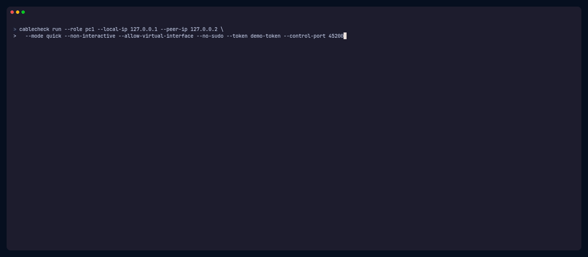
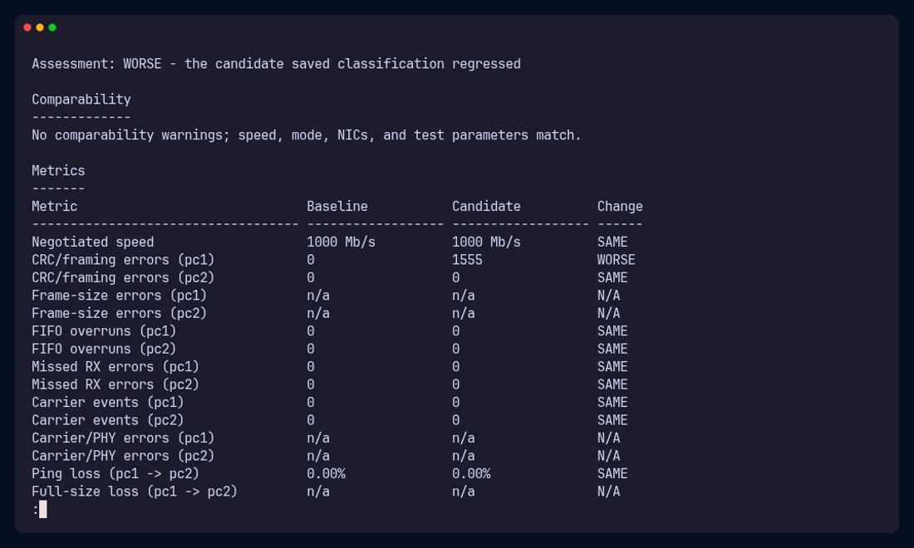

# CableCheck

<p align="center">
  <a href="go.mod"></a>
  <a href="https://github.com/hikarisakamoto/cablecheck/actions/workflows/main.yml"></a>
  <a href="https://github.com/hikarisakamoto/cablecheck/stargazers"></a>
  <a href="LICENSE"></a>
  <a href="#supported-environment"></a>
</p>

<p align="center">
  <strong>Turn two Linux PCs into an explainable Ethernet link tester.</strong><br>
  Exercise the link in both directions, correlate physical and transport evidence,<br>
  and leave with a verdict you can inspect, share, and compare.
</p>

<p align="center">
  <a href="#quick-start">Quick start</a> &nbsp;&middot;&nbsp;
  <a href="#watch-a-test-run">Demo</a> &nbsp;&middot;&nbsp;
  <a href="#test-modes">Test modes</a> &nbsp;&middot;&nbsp;
  <a href="#reports-and-raw-data">Reports</a> &nbsp;&middot;&nbsp;
  <a href="docs/health-rules.md">Health rules</a>
</p>

CableCheck coordinates a test between two directly connected PCs. It inspects link negotiation and NIC counters, watches carrier state through sysfs, then runs bidirectional ping, full-size ping, TCP, UDP, and stress workloads with the Linux tools already trusted by network operators.

| Physical evidence | Active load testing | Explainable verdicts | Portable evidence |
|---|---|---|---|
| CRC, framing, carrier, duplex, negotiated speed, and optional TDR | Stability ping, full-size ping, TCP, UDP, and bidirectional stress | Six health classes, a 0-100 score, ordered findings, and next actions | Self-contained HTML, Markdown, JSON, text, and raw command output |

> [!IMPORTANT]
> CableCheck tests the complete path between two hosts, not the cable in isolation. A bad result is strong evidence for controlled substitution with a known-good cable, not proof that one component has failed.

## Watch a test run

This is a real two-peer quick-mode run using CableCheck's hermetic loopback demo tools. It shows the coordinator command, authenticated handshake, synchronized countdown, live phase progress, report generation, and final summary. Playback is accelerated 3x.

<p align="center">
  <picture>
    <source media="(prefers-reduced-motion: reduce)" srcset="docs/assets/cablecheck-run-poster.png">
    
  </picture>
</p>

<p align="center"><sub>The demo intentionally uses a virtual interface, so CableCheck returns <code>INCONCLUSIVE</code> instead of pretending it tested a physical cable. <a href="docs/assets/cablecheck-run.tape">View the VHS tape source.</a></sub></p>

## See it catch a bad link

CableCheck's `compare` command can contrast a known-good baseline with a suspect run. In this canonical example, the candidate keeps 1 Gb/s link speed and zero packet loss, but 1,555 new CRC-class errors correctly move the saved verdict from `EXCELLENT` to `FAILED`.

<p align="center">
  <a href="docs/assets/cablecheck-vhs.gif"></a>
</p>

<p align="center"><sub><a href="docs/assets/cablecheck-vhs.gif">Play the comparison recording</a> or <a href="docs/assets/cablecheck-vhs.tape">view its VHS tape source</a>.</sub></p>

Abridged CLI output:

```text
Baseline:  example-healthy     EXCELLENT  score 100/100
Candidate: example-crc-errors  FAILED     score 25/100
Saved verdict: EXCELLENT -> FAILED

ADDED: [failed] PHY-02: CRC-class receive errors incremented by 1555 during the test.
```

### Explore the example reports

These are synthetic, deterministic scenarios rendered by the same evaluator and report pipeline used for real runs.

| Scenario | Verdict | What it demonstrates | Reports |
|---|---|---|---|
| Clean 1 Gb/s link | `EXCELLENT` 100/100 | No loss, retransmits, physical errors, or findings | [Summary](examples/healthy/summary.txt) · [Full report](examples/healthy/report.md) · [JSON](examples/healthy/report.json) |
| Link falls back to 100 Mb/s | `POOR` 50/100 | Both NICs support 1 Gb/s, but the link negotiates at 100 Mb/s | [Summary](examples/reduced-speed/summary.txt) · [Full report](examples/reduced-speed/report.md) · [JSON](examples/reduced-speed/report.json) |
| CRC errors under load | `FAILED` 25/100 | Throughput looks healthy while receive CRC errors climb by 1,555 | [Summary](examples/crc-errors/summary.txt) · [Full report](examples/crc-errors/report.md) · [JSON](examples/crc-errors/report.json) |
| CPU-saturated host | `INCONCLUSIVE` | Poor throughput is softened because host load can explain it | [Summary](examples/host-limited/summary.txt) · [Full report](examples/host-limited/report.md) · [JSON](examples/host-limited/report.json) |
| Link drops mid-run | `FAILED` 25/100 | Carrier loss, repeated carrier state changes, and missing critical evidence | [Summary](examples/failed/summary.txt) · [Full report](examples/failed/report.md) · [JSON](examples/failed/report.json) |

## Quick start

You need CableCheck and its four runtime tools on **both** Linux PCs. Normal test runs are unprivileged; assigning temporary link addresses may require root.

1. Install the runtime tools:

   ```bash
   # Arch Linux
   sudo pacman -S iperf3 ethtool iputils iproute2

   # Debian / Ubuntu
   sudo apt update && sudo apt install iperf3 ethtool iputils-ping iproute2

   # Fedora
   sudo dnf install iperf3 ethtool iputils iproute
   ```

2. Build the static binary with Go 1.26+ and install it as a command:

   ```bash
   make build
   sudo install -m 0755 cablecheck /usr/local/bin/cablecheck
   cablecheck version
   ```

3. Connect the ports and assign a private address to each tested interface:

   ```bash
   # PC1
   sudo ip addr add 192.168.50.1/24 dev enp3s0
   sudo ip link set dev enp3s0 up

   # PC2
   sudo ip addr add 192.168.50.2/24 dev enp4s0
   sudo ip link set dev enp4s0 up
   ```

4. Check each machine, then start the coordinator on PC1:

   ```bash
   cablecheck doctor
   cablecheck run --role pc1 --interface enp3s0 --peer-ip 192.168.50.2
   ```

5. PC1 prints a session token and a ready-to-copy command. Run that command on PC2, type `start` in both terminals, and open the report directory printed at the end.

```text
PC1 / coordinator  <==== trusted direct Ethernet link ====>  PC2 / worker
       observes + schedules       bidirectional load       observes + executes
```

The rest of this guide covers interface setup, modes, flags, reports, interpretation, and troubleshooting in detail.

## What CableCheck can and cannot prove

CableCheck can expose symptoms consistent with a bad cable: CRC and framing errors under load, carrier drops, renegotiation, half duplex, reduced negotiated speed, size-dependent packet loss, retransmissions, UDP loss, and cable-test/TDR faults.

What it can't do is prove the cable is the failed component. The measured path also contains both connectors, both NICs or ports, any USB adapters, their drivers, and both hosts. A `POOR` or `FAILED` result is strong evidence that deserves isolation testing, not a component-level verdict. Repeat the test with a known-good cable, then test the original cable between different machines or ports if you need to.

A loopback, bridge, veth, VLAN, wireless, or other virtual interface doesn't exercise a physical cable. CableCheck rejects such an interface by default. If you explicitly allow one for a demo, the result is `INCONCLUSIVE`.

## Supported environment

CableCheck is a Go 1.26, standard-library-only program for Linux. It relies on Linux interface metadata, `/sys/class/net`, iproute2 JSON output, and physical Ethernet NICs. Local and release builds support Linux `amd64` and `arm64`.

Runtime requirements on **both** PCs:

- `iperf3` 3.7 or newer, with JSON support. It's validated through 3.17, and newer releases are accepted because the JSON output is backward-compatible and feature detection reads `iperf3 --help`. Native `--bidir` is used only when both peers support it; otherwise CableCheck uses two coordinated one-way phases.
- `ethtool` for link state and NIC statistics.
- `iputils` `ping`. BusyBox `ping` isn't supported.
- `iproute2` for `ip -j` interface and counter data.
- A physical wired Ethernet interface. USB Ethernet adapters work, but can make performance results host-limited.

`make build` produces a static binary with no runtime Go dependency. It does not bundle the four tools above. Build once and copy it to the other PC when both machines use the same architecture; `make dist` cross-compiles Linux `amd64` and `arm64` binaries.

To install a locally built binary as `cablecheck`, put it on your `PATH` on both machines:

```bash
# System-wide (needs root)
sudo install -m 0755 cablecheck /usr/local/bin/cablecheck

# Or per-user, if ~/.local/bin is on your PATH
install -m 0755 cablecheck ~/.local/bin/cablecheck
```

If you don't install it, substitute `./cablecheck` for `cablecheck` in the commands below.

## Prepare the direct link

Connect the two Ethernet ports directly. Modern NICs normally handle MDI-X automatically; a crossover cable is usually unnecessary.

First list interface names and assigned addresses:

```bash
ip addr
```

Interface names vary by machine, such as `enp3s0`, `eno1`, or `enx...`. Substitute the real name for `enpXsY` below. Assign temporary addresses on an otherwise unused subnet and bring each interface up:

```bash
# PC1
sudo ip addr add 192.168.50.1/24 dev enpXsY
sudo ip link set dev enpXsY up

# PC2
sudo ip addr add 192.168.50.2/24 dev enpXsY
sudo ip link set dev enpXsY up
```

Run `ip addr` again to confirm that PC1 owns `192.168.50.1` and PC2 owns `192.168.50.2`. CableCheck normally discovers the interface by an exact match on `--local-ip`. Use `--interface enpXsY` only when you want to require a particular interface.

The `ip addr add` assignments are temporary. They disappear on reboot, or you can remove them once testing is done. See [Tear down the link](#tear-down-the-link) below.

## Check the machines first

`doctor` checks the required tools, verifies iputils `ping`, detects the supported `iperf3` features, inventories interfaces, probes passwordless sudo, and checks that the output directory is writable. It doesn't contact the other PC or run a cable test.

```bash
cablecheck doctor
cablecheck doctor --interface enpXsY --output .
```

Warnings don't make `doctor` fail. Any failed check makes it exit 4.

## Run a test

Start PC1 first. It binds only `192.168.50.1`, generates a short 6-digit session token when `--token` is omitted, and prints both the token and a ready-to-copy PC2 command in a boxed callout. The command includes the effective control and iperf ports, so it also works with custom ports:

```bash
# PC1: coordinator
cablecheck run --role pc1 --local-ip 192.168.50.1 --peer-ip 192.168.50.2
```

Copy the displayed token into the PC2 command:

```bash
# PC2: worker
cablecheck run --role pc2 --local-ip 192.168.50.2 --peer-ip 192.168.50.1 --token <token shown by PC1>
```

To skip looking up the address, name the interface instead and let CableCheck infer `--local-ip` from it, as long as the interface has exactly one IPv4 address:

```bash
# --local-ip inferred from the interface's sole IPv4 address
cablecheck run --role pc1 --interface enpXsY --peer-ip 192.168.50.2
```

PC2 binds its outgoing control connection to its `--local-ip` and retries connection attempts for up to 60 seconds. PC1 accepts only the configured peer IP.

After the authenticated handshake, each terminal waits for its local operator. Type:

```text
start
```

Once both sides have sent `ready`, PC1 sends a synchronized start confirmation with a 3.5-second lead. Each side anchors the countdown to receipt of that message and prints `3… 2… 1… GO`. The interactive commands are `start`, `status`, and `quit`. `--non-interactive` sends readiness automatically.

During testing, a terminal shows live progress; redirected output uses discrete plain lines.
At completion, PC1 prints a boxed summary with the health classification, headline link and
test measurements, important findings, recommendations, and report directory. Use `--quiet`
to restore the compact one-line verdict and report path. Color is automatic for terminals,
can be forced with `--color always`, and can be disabled with `--color never` or `NO_COLOR`.

### Session tokens

The token authenticates the two CableCheck processes for one session. When `--token` is omitted, PC1 generates a random 6-digit code (from a cryptographic source) that's easy to read aloud and retype on PC2. PC2 always requires `--token`. A token you supply yourself must contain 6–128 printable ASCII characters with no whitespace.

The 6-digit code is a session guard for two known computers on a trusted direct cable or trusted internal/isolated network. It prevents an accidental cross-connection to the wrong process, not a determined attacker. The token is sent in plaintext inside the opening control message, so it isn't encryption and doesn't make an untrusted network safe. CableCheck never writes the token to reports or structured logs. Do not expose CableCheck's control port to the Internet or an untrusted LAN.

## Test modes

All modes inspect link settings, take per-peer counter snapshots, and run a sysfs link monitor at a 1-second default interval. TCP uses four parallel streams by default. The UDP rate defaults to 80% of negotiated link speed. When speed is unknown, CableCheck uses 100 Mbit/s and records that limitation.

| Mode | Default workload |
|---|---|
| `quick` | 500-packet stability ping at a requested 20 ms interval in both directions; 100 full-size, don't-fragment pings at 200 ms in both directions; one 30 s TCP run in each direction; one 30 s bidirectional stress run; one 20 s UDP run in each direction; initial/final counters. |
| `standard` | 1,500-packet stability ping at 20 ms in both directions; the same 100-packet full-size test; two 60 s TCP runs in each direction; one 60 s bidirectional stress run; a 30 s UDP run in each direction at the primary rate and another in each direction at half that rate; initial/final counters. |
| `soak` | A one-hour wall-clock budget by default. After one link inspection and initial counters, each cycle takes counters, runs 500-packet ping in both directions, one 60 s TCP run in each direction, and one 20 s UDP run in each direction. `periodic` inserts a 60 s default idle gap between cycles; `continuous` runs cycles back-to-back. Full-size ping and bidirectional stress are not part of soak cycles. |

The native bidirectional test runs both directions together. If either peer lacks `iperf3 --bidir`, the fallback runs two coordinated one-way clients simultaneously on separate ports for approximately the configured TCP duration.

Examples:

```bash
# Standard mode
cablecheck run --role pc1 --local-ip 192.168.50.1 --peer-ip 192.168.50.2 --mode standard

# Six-hour continuous soak on PC1; use the printed token on PC2
cablecheck run --role pc1 --local-ip 192.168.50.1 --peer-ip 192.168.50.2 \
  --mode soak --soak-duration 6h --soak-load continuous
```

### `run` flags and defaults

Flags must follow the subcommand. Boolean flags take no separate value; use `--cable-test=false`, not `--cable-test false`.

| Flag | Default and meaning |
|---|---|
| `--role pc1\|pc2` | Required. PC1 coordinates; PC2 works. |
| `--local-ip IPv4` | Required unless `--interface` is given; the local tested-interface address. |
| `--peer-ip IPv4` | Required; the other PC's tested-interface address. |
| `--interface name` | Empty: discover by exact ownership of `--local-ip`. When given, `--local-ip` may be omitted and is inferred from this interface's sole IPv4 address (zero or several IPv4 addresses require an explicit `--local-ip`). |
| `--control-port N` | `44300`; control TCP port, range 1024–65535. It must not equal either iperf port. |
| `--iperf-port N` | `44301`; range 1024–65534. `N+1` is also reserved for bidirectional fallback. |
| `--token string` | Empty on PC1 means generate one; required on PC2. |
| `--mode quick\|standard\|soak` | `quick`. |
| `--tcp-duration D` | `30s` quick; `60s` standard and soak. |
| `--udp-duration D` | `20s` quick and soak; `30s` standard. |
| `--udp-rate rate` | Empty: derive 80% of negotiated speed. Accepts 1M–40G decimal bit rates such as `800M` or `2.5G`. |
| `--parallel-streams N` | `4`; range 1–16. |
| `--soak-duration D` | `1h` in soak mode; invalid outside soak; range 60 s–24 h. |
| `--soak-load periodic\|continuous` | `periodic` in soak mode; invalid outside soak. |
| `--monitor-interval D` | `1s`; range 200 ms–30 s. |
| `--cable-test` | `false`; append `ethtool --cable-test`. |
| `--cable-test-tdr` | `false`; request TDR and imply `--cable-test`. |
| `--quiet` | `false`; use the compact end-of-run verdict and report path instead of the boxed summary. |
| `--verbose` | `false`; show verbose progress/debug logging. |
| `--non-interactive` | `false`; send readiness without waiting for `start`. |
| `--no-sudo` | `false`; never probe or use sudo. |
| `--no-report-transfer` | `false`; disable the PC1-to-PC2 report copy. |
| `--allow-virtual-interface` | `false`; permit loopback/virtual interfaces for demos, yielding `INCONCLUSIVE`. |
| `--output dir` | `.`; existing parent directory for the timestamped report directory; `..` path elements are rejected. |
| `--color auto\|always\|never` | `auto`; color terminals automatically, force ANSI, or disable ANSI. `NO_COLOR` suppresses automatic color. |

TCP and UDP durations accept 5 seconds through 10 minutes. Ports must be unprivileged; the control port must not collide with the iperf ports.

## Optional cable diagnostics and privileges

Normal operation is unprivileged. Link inspection, NIC statistics, `ip`, `ping`, `iperf3`, sysfs monitoring, and report generation don't require root.

Only `ethtool --cable-test` and `ethtool --cable-test-tdr` may require root or `CAP_NET_ADMIN`. They're opt-in because a driver may temporarily drop the link while testing. CableCheck uses the current EUID when already root; otherwise it uses only passwordless `sudo -n` and never prompts mid-test. `--no-sudo` skips the sudo probe. Missing privilege or driver support makes the diagnostic unavailable, but doesn't itself mark the cable failed.

```bash
cablecheck run --role pc1 --local-ip 192.168.50.1 --peer-ip 192.168.50.2 --cable-test

# Base cable test plus TDR, if supported by NIC, driver, kernel, and ethtool
cablecheck run --role pc1 --local-ip 192.168.50.1 --peer-ip 192.168.50.2 --cable-test-tdr
```

The cable-test step widens both peers' control-channel idle timeout before the disruptive command. Any link events in that coordinated window are marked self-inflicted and excluded from spontaneous carrier-error evidence.

## Interpreting the result

| Classification | Meaning |
|---|---|
| `EXCELLENT` | Clean physical, transport, and performance evidence with sufficient coverage; score 95–100. |
| `GOOD` | No warning-level fault, but an informational deviation or reduced noncritical coverage prevents `EXCELLENT`; score 80–94. |
| `WARNING` | A warning-level physical, transport, or performance deviation—such as modest counter movement, a small negotiated-speed reduction, low loss, or speed-relative throughput in the warning tier; score 51–79. |
| `POOR` | Strong physical evidence—including negotiation at no more than half the expected speed—or a poor transport/performance result not explained solely by a host limit; score 26–50. |
| `FAILED` | Failure-level physical evidence, such as link down, at least three carrier events, severe CRC movement, an open/short cable-test result, or correlated UDP loss and physical errors; score 0–25. |
| `INCONCLUSIVE` | The evidence cannot support a cable verdict: virtual interface, critical evidence missing, an otherwise clean partial run, poor performance explained by CPU/USB host limitation, or a throughput test that could not reach the peer's data port (firewall/routing on the receiving side). Score is JSON `null`. |

Physical evidence dominates. CPU saturation can soften poor performance to `INCONCLUSIVE`, but it never hides physical `POOR` or `FAILED` evidence. See [docs/health-rules.md](docs/health-rules.md) for the complete thresholds and scoring rules.

## Reports and raw data

Each process creates a private timestamped directory under `--output`. PC1's
authoritative directory has this layout:

```text
cablecheck-report-YYYY-MM-DD_HH-MM-SS/
├── summary.txt       short operator summary
├── report.md         full human-readable report
├── report.html       self-contained browser report (PC1 only)
├── report.json       schema-versioned source record
└── raw/              command output and CableCheck debug evidence
```

PC2 creates its own `raw/` evidence while the run is active and always writes a
local `diagnostic.json` on exit. That file records its role, test ID, mode, IPs,
final state, any error, the reason and detail of a peer abort, PC1's verdict, and
an index of its own raw files. It isn't a full report (no classification) and is
never transferred; it exists so a failed run is debuggable from PC2 alone. By
default PC1 then transfers `report.json`, `report.md`, and `summary.txt` into
PC2's report directory. If transfer is disabled or fails, PC2 keeps its local
raw data and writes a local summary fallback instead. Since `raw/` and
`diagnostic.json` are never transferred, inspect both machines' local report
directories when diagnosing parser or driver behavior.

`report.html` is generated only in PC1's authoritative directory and is not
transferred to PC2. It contains inline CSS and SVG charts with no JavaScript or
external resources, so it can be opened fully offline.

The transfer manifest carries each file's size and SHA-256. PC2 accepts only the three fixed filenames, caps each file at 8 MiB and the set at 16 MiB, writes to a `.part` file, verifies size and digest, then renames it. A failed file is retried once. Transfer failure is a warning and doesn't change the health classification or exit code. Set `--no-report-transfer` on either peer to disable or decline transfer.

Re-render HTML, Markdown and text from a saved JSON record without re-evaluating its verdict:

```bash
cablecheck report cablecheck-report-2026-07-19_12-00-00/report.json
cablecheck report --output /existing/output/dir path/to/report.json
```

See [docs/report-schema.md](docs/report-schema.md) for the JSON contract and the committed [healthy example](examples/healthy/report.json).

## Tear down the link

CableCheck cleans up after **itself** automatically, on both a normal finish and Ctrl-C. It stops every `iperf3` server it started, terminates its own child processes (by tracked PID and process group, never with a blanket `pkill`), releases its control and `iperf3` ports, and removes its temporary run state under `$XDG_RUNTIME_DIR/cablecheck`, root-only `/run/cablecheck`, or the `/tmp/cablecheck` fallback. Report directories are deliverables, so they're kept.

The only thing you undo by hand is the temporary network configuration you added in [Prepare the direct link](#prepare-the-direct-link). Reverse those two steps on **each** PC: remove the address, and set the interface back down if you brought it up only for this test.

```bash
# PC1
sudo ip addr del 192.168.50.1/24 dev enpXsY
sudo ip link set dev enpXsY down

# PC2
sudo ip addr del 192.168.50.2/24 dev enpXsY
sudo ip link set dev enpXsY down
```

Substitute the real interface name for `enpXsY`. Skip the `ip link set ... down` step if the interface was already up and in use before testing. A reboot also clears the temporary address if you prefer not to remove it manually.

If a run was killed uncleanly (for example `kill -9`) and left an `iperf3` server or stale run state behind, the next run's preflight detects the leftover. It verifies ownership against `/proc` first, then fails with guidance to clear it rather than touching an unrelated process.

## Compare with a known-good cable

Use controlled substitutions:

1. Save the original report and raw directories.
2. Keep both PCs, NIC ports, IP settings, mode, and test parameters unchanged.
3. Replace only the cable with a known-good Cat5e/Cat6 cable and rerun.
4. Compare the original baseline with the candidate run:

   ```bash
   cablecheck compare path/to/baseline/report.json path/to/candidate/report.json
   ```

   The command shows the saved verdict transition, negotiated speed, physical-error
   counters, ping and full-size loss, TCP throughput and retransmissions, UDP loss,
   and finding changes. It warns when the mode, negotiated speed, NICs, or test
   parameters differ, but still renders the comparison.
5. If the symptom persists, move the test to different NIC ports or different PCs before blaming the original cable.

This A/B comparison is much stronger than an isolated throughput number. CableCheck
does not re-evaluate saved reports: their classifications remain authoritative, and
the per-metric tally is descriptive rather than a replacement verdict.

## Common false positives

- **Host-limited throughput:** CPU saturation, interrupt handling, memory pressure, or another workload can hold TCP well below line rate with clean physical counters.
- **USB Ethernet adapters:** the USB bus, adapter chipset, thermals, or driver can cap or destabilize throughput. CableCheck records USB attachment as host-limitation evidence.
- **Power saving and frequency scaling:** CPU or NIC power management can produce uneven throughput and latency spikes.
- **Self-inflicted UDP saturation:** an explicit rate above 95% of known link speed is recorded as near-saturation, and its loss isn't used as cable evidence.
- **MTU mismatch:** don't-fragment ping errors point to configuration, not directly to the cable.
- **Unsupported or missing counters:** absence means “not measured,” not zero errors. Missing critical evidence can make the result `INCONCLUSIVE`.

## Security assumptions

CableCheck is for a trusted direct cable or trusted isolated LAN only. The control protocol is authenticated by the shared token but isn't encrypted. Don't run it on an untrusted or hostile network.

PC1 binds the control listener only to the supplied `--local-ip`, never `0.0.0.0`, and silently rejects connections whose source IP isn't `--peer-ip`. The token is compared in constant time and omitted from reports and logs. Protocol payloads are decoded into a fixed catalog of structs and test operations, with no arbitrary type or command deserialization. These safeguards don't replace transport encryption.

## Exit codes

| Code | Meaning |
|---:|---|
| 0 | Completed with `GOOD` or `EXCELLENT`. |
| 1 | Completed with `WARNING`. |
| 2 | Completed with `POOR` or `FAILED`. |
| 3 | Completed with `INCONCLUSIVE`. |
| 4 | Configuration or dependency failure, including `doctor` failure and a PC2 token/handshake rejection. |
| 5 | Peer or orchestration failure, including peer abort, disconnect, request timeout, plan failure, or a coordinator that cannot establish a valid handshake. |
| 6 | Local interrupt: Ctrl+C/SIGTERM, `quit`, or interactive stdin EOF. |
| 7 | Internal error, including report persistence failure or an invalid internal verdict. |

Ctrl+C attempts to preserve completed measurements in a partial PC1 report. The interrupted side exits 6, and the other side normally observes a peer abort and exits 5.

## Troubleshooting

**“required tool not found” or `doctor` reports FAIL**  
Install the exact package shown by `cablecheck doctor`. Confirm that `ping -V` identifies iputils and that `iperf3 --version` is 3.7 or newer.

**Local IP is not assigned / interface not found**  
Run `ip -j addr`, check the exact address and interface name, bring the interface up, and reapply the temporary address. `--interface` doesn't bypass the requirement that the interface own `--local-ip`.

**Interface is down or no carrier appears**  
Check both connectors and NIC LEDs, run `ip link show dev enpXsY`, and verify that both interfaces are up before starting CableCheck.

**PC2 seems to hang at “ready — waiting for peer”**  
This is normal. The synchronized start waits until *both* sides are ready. Type `start` in each terminal, or pass `--non-interactive` to auto-ready. PC2 proceeds the moment PC1 confirms the start.

**PC2 cannot connect**  
Start PC1 first, confirm both control commands use mirrored IPs, verify TCP port 44300 is not filtered, and check that each machine can reach the other's direct-link address. PC2 retries for up to 60 seconds.

**Throughput test cannot connect / result is INCONCLUSIVE citing a firewall**  
The control channel only needs the dialing side to reach the listener. The throughput tests also need the *receiving* side to accept an inbound iperf3 connection on the data ports (`--iperf-port` and base+1). A host firewall (ufw, firewalld) that denies inbound traffic drops those connections even though the control channel worked, so the throughput test is recorded as `INCONCLUSIVE` with a firewall recommendation instead of a cable verdict. Allow the peer on both machines (for a trusted direct link, `sudo ufw allow from <peer-ip>`) or open the data ports, then rerun.

**Token rejected**  
Copy the current token printed by PC1 exactly. Restart PC2 with that token. PC1 allows three wrong-token handshake attempts before it exits 5.

**Port already in use**  
Choose a free `--control-port` and `--iperf-port` on both peers. CableCheck requires both the iperf base port and base+1 to be free.

**Cable test unavailable**  
This is expected on NICs or drivers without ethtool netlink cable-test support. Run without `--no-sudo`, configure passwordless sudo if appropriate, or run CableCheck as root only when you explicitly need cable diagnostics. Normal tests do not need root.

**Low throughput with clean counters**  
Close other workloads, watch CPU utilization, try `--parallel-streams 1`, disable aggressive power saving temporarily, and repeat without USB adapters where possible. Compare against a known-good cable before assigning blame.

**Report did not arrive on PC2**  
Check whether either side used `--no-report-transfer`, then inspect both `raw/cablecheck-*.log` files. PC1's report remains authoritative even when transfer is declined or fails.

## Loopback end-to-end demo

The repository includes stub `ping`, `iperf3`, and `ethtool` tools and a scripted two-peer loopback demo:

```bash
make demo-e2e
# or, after make build:
./scripts/demo-e2e.sh
```

The script runs PC1 on `127.0.0.1` and PC2 on `127.0.0.2` with `--allow-virtual-interface --non-interactive`, checks both report directories (including PC1-only `report.html`), verifies matching SHA-256 hashes for the transferred `report.json`, and tests offline report regeneration. Each CableCheck peer exits 3 because loopback correctly forces `INCONCLUSIVE`. The wrapper script treats those expected peer exits as success and exits 0.

## Further documentation

- [Architecture](docs/architecture.md)
- [Control protocol](docs/protocol.md)
- [Report schema](docs/report-schema.md)
- [Health rules](docs/health-rules.md)

CableCheck is licensed under GPL-3.0. See [LICENSE](LICENSE).
